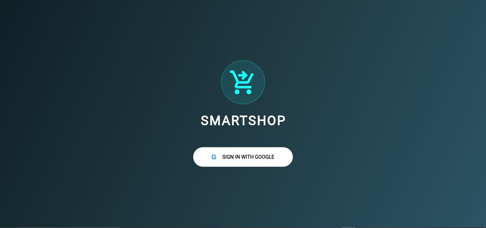
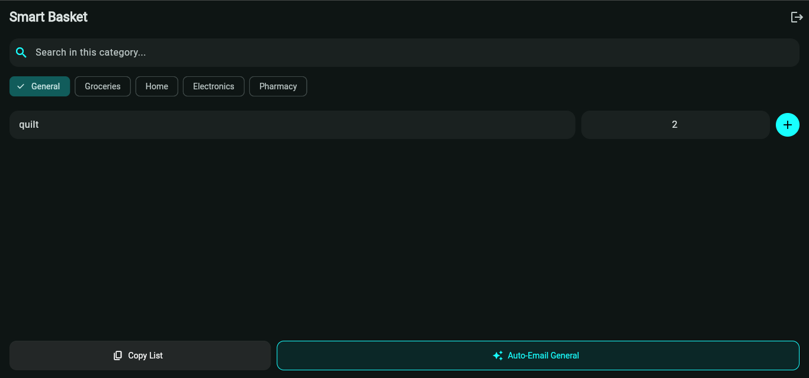
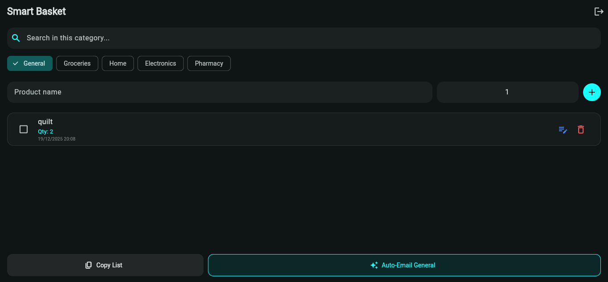
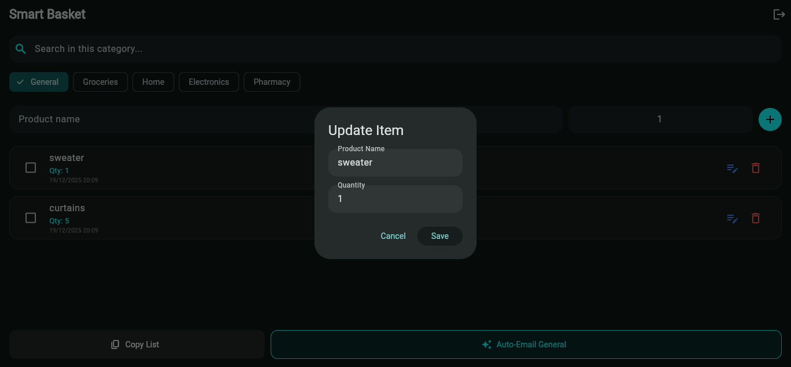
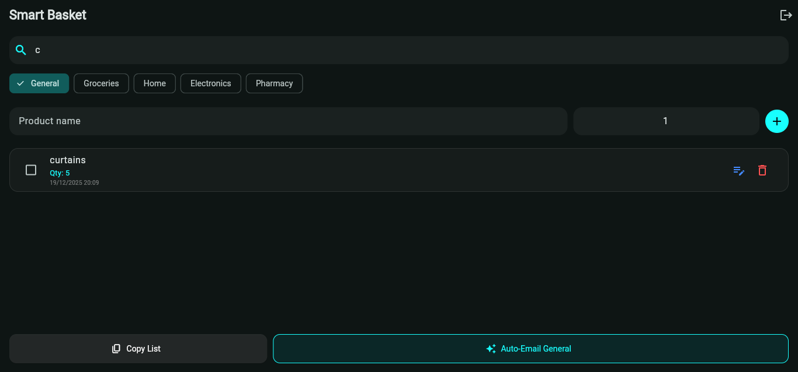
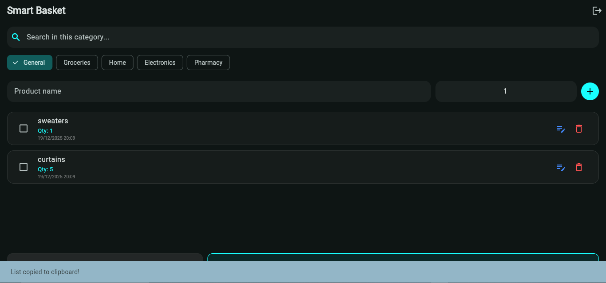
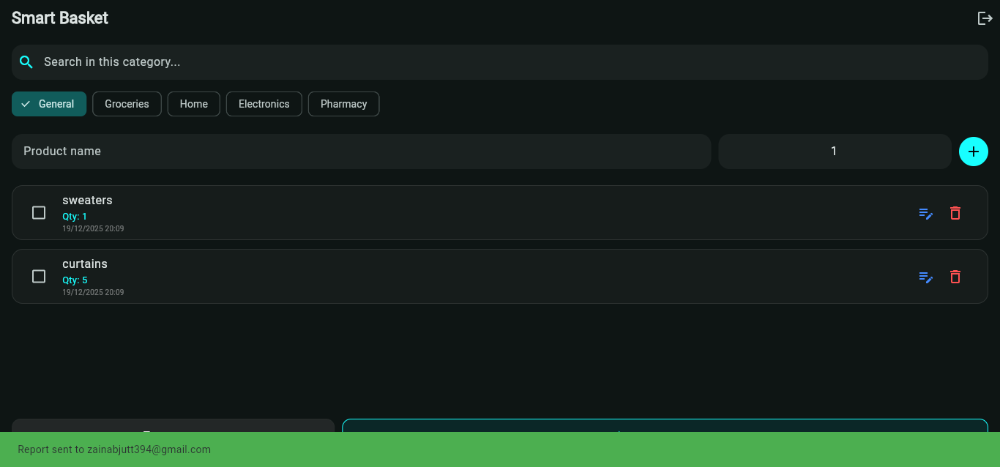

# 🛒 SMARTSHOP– A Full-Stack Flutter Web App!


[](https://opensource.org/licenses/MIT)


## 📱 Overview
**SmartShop Pro** is a modern, feature-rich shopping list application built with **Flutter Web**. It allows users to create, manage, and share shopping lists across sessions with a seamless, cloud-synced experience. 

Designed for efficiency, it features automated background email reporting and a sleek glassmorphic UI.

> **Note:** If you like the project, consider supporting it by leaving a ⭐ on the repository!

---

<p align="center">
  
   
  
  
  
  
  
  
  
</p>

## 🚀 Features
- ✅ **Secure Authentication** — Google Sign-In integration via Firebase.
- ✅ **Real-time Sync** — Instant updates across devices using Cloud Firestore.
- ✅ **Automated Email Reports** — Send formatted lists to your Gmail via EmailJS (Background).
- ✅ **Categorized Management** — Dedicated sections for Groceries, Home, Electronics, and Pharmacy.
- ✅ **Input Validation** — Strict numerical restrictions for quantities.
- ✅ **Smart Clipboard** — One-tap copy-to-clipboard functionality.
- ✅ **Beautiful UI** — Dark mode Material 3 design with cyan accents and modern transparency.

---

## 🛠️ Technology Stack

### **Frontend & Framework**
- **Flutter Web** — Main UI Framework.
- **Dart** — Core Programming Language.
- **Material 3** — Modern Design System.

### **Backend & Services**
- **Firebase Auth** — Secure user identity management.
- **Cloud Firestore** — Real-time NoSQL database for list persistence.
- **EmailJS REST API** — Serverless background email automation.
- **HTTP Package** — Asynchronous API communication for reporting.

---

## 🏗️ Project Structure
```text
smartshop_pro
├─ lib
│  ├─ main.dart          # Main application entry & UI logic
│  ├─ services/          # Firebase & EmailJS integration
│  └─ models/            # Data models for shopping items
├─ assets/               # Application icons and UI screenshots
├─ web/                  # Web-specific build configurations
├─ pubspec.yaml          # Dependencies and project metadata
└─ README.md             # Project documentation
```
---
## 🚀 Getting Started

### **Prerequisites**
Before you begin, ensure you have the following installed and configured:
* **Flutter SDK:** version `3.10.0` or higher.
* **Firebase Project:** A project created in the [Firebase Console](https://console.firebase.google.com/).
* **EmailJS Account:** Required for the automated reporting feature.
* **Browser:** Google Chrome is recommended for development and testing.

### **Run the Project Locally**

1. **Clone the repository:**
   ```bash
   git clone [https://github.com/YOUR_USERNAME/smartshop_pro.git](https://github.com/YOUR_USERNAME/smartshop_pro.git)
   ```
2. **Install Dependencies:**
   Navigate to the project folder and run:
   ```bash
   flutter pub get
   ```
3. **Configure Firebase: Use the FlutterFire CLI to link your project and generate the necessary configuration:**
   ```Bash
   flutterfire configure
    ```
4. **Launch the Web App:**
    ```Bash
    flutter run -d chrome
    ```
### **💻 Supported Platforms**
The application is currently optimized for:

🌐 Web (Chrome, Edge, Safari, and Firefox)

📱 PWA Support (Can be "installed" on mobile homescreens via Chrome)

---

## 📄 License

This project is licensed under the **MIT License**. 

> Permission is hereby granted, free of charge, to any person obtaining a copy of this software and associated documentation files to deal in the Software without restriction, including without limitation the rights to use, copy, modify, merge, publish, distribute, sublicense, and/or sell copies of the Software.

See the [LICENSE](LICENSE) file for more details.

---

## 👨‍💻 Author

**zainab**

* **GitHub:** [@znb919](https://github.com/znb919)
* **LinkedIn:** www.linkedin.com/in/zainab919
---

> Built with ❤️ using Flutter & Firebase.
